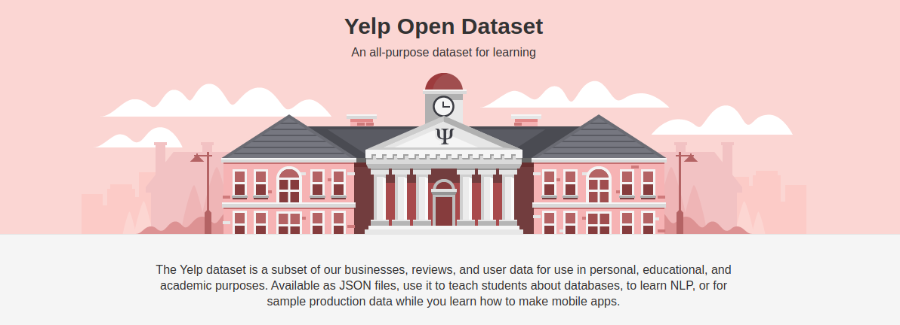
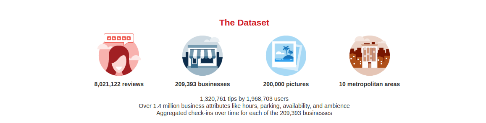
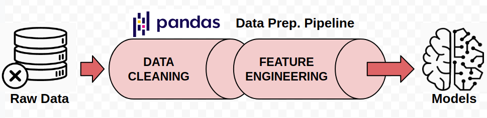
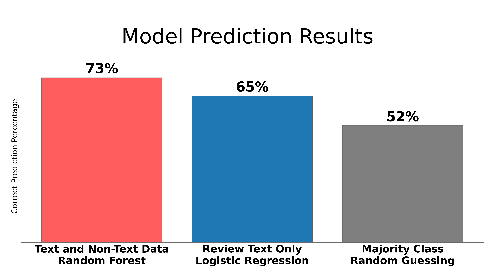
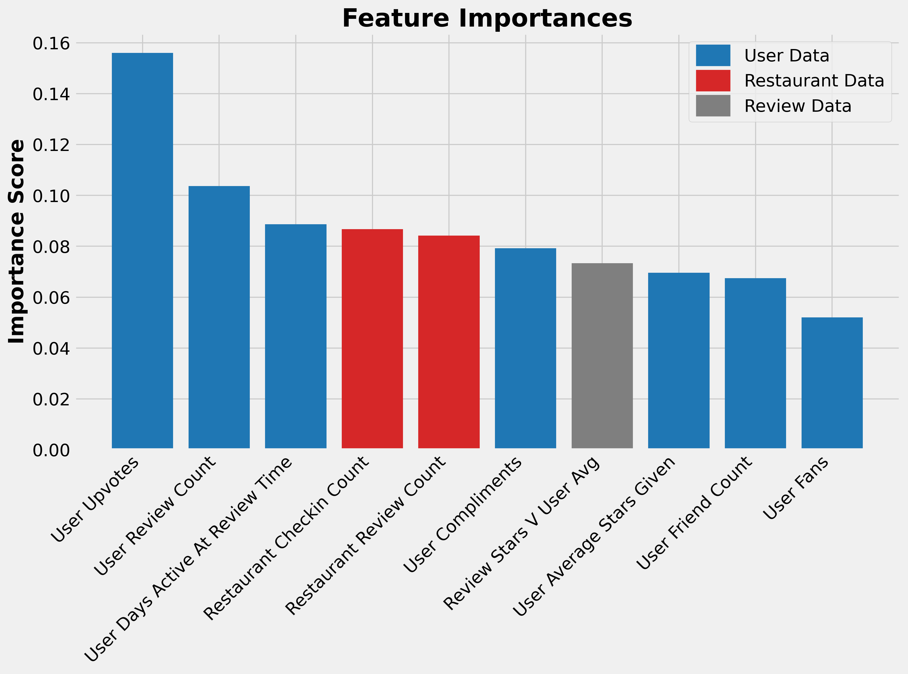
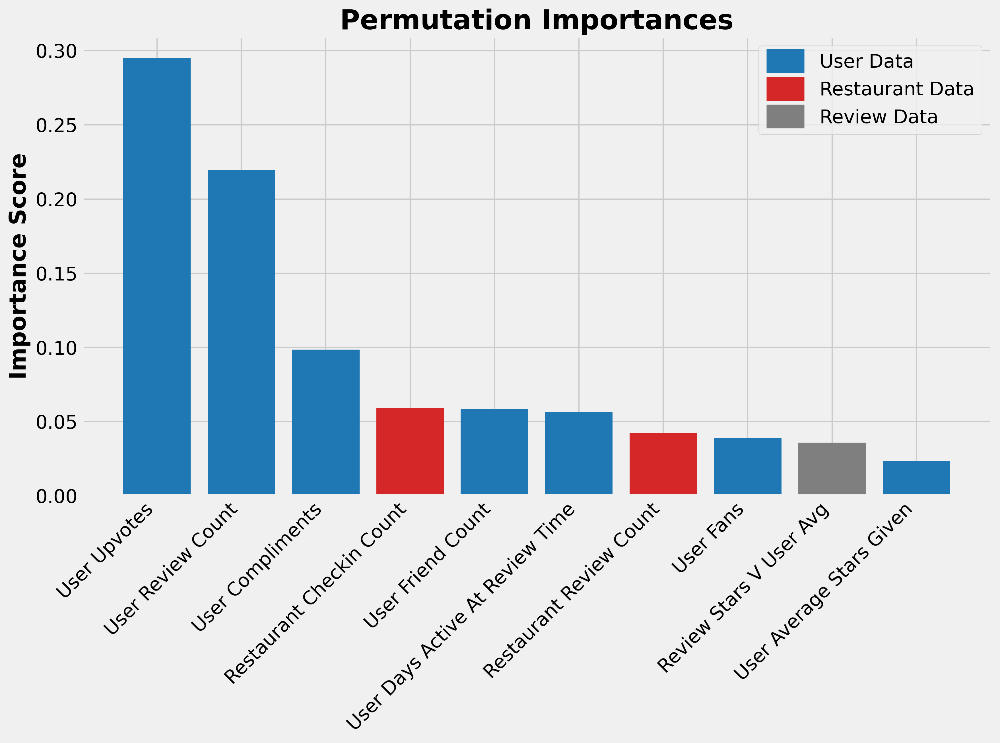

# Predicting Yelp Review Quality

## Table of Contents
* [Introduction](#Introduction)
    * [Motivation](#Motivation)
    * [Goal and Central Questions](#Goal-and-Central-Questions)
    * [The Data](#The-Data)
* [Data Storage](#Data-Storage)
* [Data Pipeline](#Data-Pipeline)
    * [Data Cleaning](#Data-Cleaning)
    * [Time Discounting](#Time-Discounting)
    * [Target Creation](#Target-Creation)
    * [Metadata Feature Engineering](#Metadata-Feature-Engineering)
    * [NLP Feature Engineering](#NLP-Feature-Engineering)
* [Data Modeling](#Data-Modeling)
    * [Model Setup](#Model-Setup)
    * [Model Results](Model-Results)
* [Conclusions](#Conclusions)
* [Next Steps](#Next-Steps)
* [Photo and Data Credits](#Photo-and-Data-Credits)

  

# Introduction

## Motivation

I have a personal and professional interest in the leisure/tourism industry with a focus on two things:
1. The perceived quality and popularity of places and points of interest (POIs). 
    * Examples: Restaurants, Bars/Nightlife, Breweries, Music Venues, Parks and Outdoor Spaces. 
    * Very broad focus. Pretty much anything that involves the combination of leisure and being in public.
2. Creating a way to connect people to these places/POIs in a way that is more beneficial to both the places/POIs and the people than current common methods. 

Yelp and other similar companies like Foursquare, Google Places, TripAdvisor, etc. are the current leaders in this space, though I believe there are substantial untapped opportunities in this space.
Working with and better understanding the data available to these companies will help us to more fully take advantage of these opportunities.

## Goal and Central Questions

The goal of my project is to explore a way to increase user retention, satisfaction, and engagement for Yelp and other companies that incorporate reviews into their platforms. This will be accomplished by predicting the highest quality reviews given knowledge gained from the review text and the data surrounding the reviews.

### Central Questions
### 1. Can the quality of a review be determined by the review text or the data surrounding the review?
### 2. What types of data are most useful for predicting review quality?

## The Data

The data for this project comes from the Yelp Open Dataset.  
[Dataset](https://www.yelp.com/dataset), [Documentation](https://www.yelp.com/dataset/documentation/main), [Yelp Github](https://github.com/Yelp/dataset-examples), [Kaggle](https://www.kaggle.com/yelp-dataset/yelp-dataset)

### About Yelp 
> ### *
"Yelp connects people with great local businesses. With unmatched local business information, photos and review content, Yelp provides a one-stop local platform for consumers to discover, connect and transact with local businesses of all sizes by making it easy to request a quote, join a waitlist, and make a reservation, appointment or purchase. Yelp was founded in San Francisco in 2004."
*

[Yelp News](https://www.yelp-press.com/news/default.aspx), [Fast Facts and Stats](https://www.yelp-press.com/company/fast-facts/default.aspx) <--- Say that 10 times fast.

### About the Data 

This dataset consists of 5 separate json files totaling ~10GB of data uncompressed. Overall, there is a mix of data-types. The most common ones include long text strings, date-times, booleans, and numerical counts/ratings. There are plenty of nan/null values but this is partially offset by the size of the dataset. The five files consist of:
* **Users**- ~2 million rows and 22 features
    * User metadata, list of friends, and stats about interactions with other users.
* **Reviews**- ~8 million reviews with 9 features.
    * 8 review metadata features and the review text.
* **Check-ins**- ~175000 businesses represented. A couple million total date-times. 
    * Date-times for check-ins for each business. 
* **Businesses**- ~210000 rows with around 30 total features.
    * Business name, address, hours, rating, review count, etc. 
    * Also includes dictionaries of more in-depth attributes like cost, accepts credit cards, good for kids, etc.
* **Tips**- ~1.3 million rows with 5 features
    * Kind of like a really short review without as much useful metadata.

  

# Data Storage

My original data came in 5 json files. The first step was to simplify, combine, and store these files in a way that would be easily searchable for future data analysis, cleaning, and feature engineering. Using the tools below I converted the original json files into a Postgres database table that could be easily accessed using Pandas.

## Original Working Dataset

|    | review_id              | user_id                | business_id            |   review_stars | review_date         | review_text                  |   review_useful |   review_funny |   review_cool | restaurant_name              | restaurant_address           | restaurant_city   | restaurant_state   | restaurant_postal_code   |   restaurant_latitude |   restaurant_longitude |   restaurant_overall_stars |   restaurant_review_count |   restaurant_is_open | restaurant_categories        |   restaurant_price_range | user_name   |   user_review_count | user_yelping_since   |   user_useful |   user_funny |   user_cool | user_elite               | user_friends                 |   user_fans |   user_average_stars_given |   user_compliment_hot |   user_compliment_more |   user_compliment_profile |   user_compliment_cute |   user_compliment_list |   user_compliment_note |   user_compliment_plain |   user_compliment_cool |   user_compliment_funny |   user_compliment_writer |   user_compliment_photos | restaurant_checkins          |
|---:|:-----------------------|:-----------------------|:-----------------------|---------------:|:--------------------|:-----------------------------|----------------:|---------------:|--------------:|:-----------------------------|:-----------------------------|:------------------|:-------------------|:-------------------------|----------------------:|-----------------------:|---------------------------:|--------------------------:|---------------------:|:-----------------------------|-------------------------:|:------------|--------------------:|:---------------------|--------------:|-------------:|------------:|:-------------------------|:-----------------------------|------------:|---------------------------:|----------------------:|-----------------------:|--------------------------:|-----------------------:|-----------------------:|-----------------------:|------------------------:|-----------------------:|------------------------:|-------------------------:|-------------------------:|:-----------------------------|
|  0 | 48GS5BhOe5Q0exkwH4qIig | r5IC7MVMH9wL-IQKx2CmXg | uh7DUWtPoZkuEE05fghJ_w |              5 | 2016-06-24 14:52:55 | Living in NYC and having ... |               1 |              0 |             0 | Beauty & Essex               | 3708 S Las Vegas Blvd, Le... | Las Vegas         | NV                 | 89109                    |               36.1099 |              -115.175  |                        4   |                      1078 |                    1 | Lounges, Restaurants, Nig... |                        3 | Kelly       |                 122 | 2009-08-19 15:54:29  |           191 |           79 |          41 |                          | 7Mhup6mfEgNAyHyfSBpQ6w, R... |           5 |                       3.81 |                     1 |                      0 |                         0 |                      0 |                      0 |                      0 |                       2 |                      0 |                       0 |                        0 |                        0 | 2016-05-11 02:52:26, 2016... |
|  1 | WxqwVmZhq5-kvvRsUun1-w | 8Dvr-U6jCZTVGD52LwC2qA | orS5gYr8phw6YfV-oEPnTw |              4 | 2018-03-22 03:32:12 | Very, very good rice roll... |               3 |              0 |             2 | Pho Xin Chào                 | 7057 Yonge Street            | Markham           | ON                 | L3T 2A6                  |               43.7996 |               -79.4201 |                        4   |                        49 |                    1 | Desserts, Food, Restauran... |                        2 | Amy         |                 388 | 2015-11-20 04:33:32  |          1149 |           83 |         265 | 2017,2018                | CQ67NJigSe5-uBDX3b_CUw, e... |          41 |                       3.78 |                     7 |                      0 |                         0 |                      0 |                      0 |                      9 |                      13 |                      7 |                       7 |                       12 |                       12 | 2018-03-04 18:29:48, 2018... |
|  2 | 5XwWfBkibiJLn9wBnD2QTQ | 3_a4J7RFtAOSh2maSH1Dlg | ZjKpGYdQCQPxzkYWAsV56w |              5 | 2018-05-18 16:26:27 | The service was quite goo... |               0 |              0 |             0 | Thailicious Authentic Tha... | 19 S Stephanie St, Ste 16... | Henderson         | NV                 | 89012                    |               36.0282 |              -115.049  |                        4.5 |                       604 |                    1 | Restaurants, Thai, Vegeta... |                        2 | Marsha      |                   8 | 2016-02-29 03:03:48  |             0 |            0 |           0 |                          | 8CQRuR-tjDy6uuGU8R7zeg, W... |           0 |                       3.88 |                     0 |                      0 |                         0 |                      0 |                      0 |                      0 |                       0 |                      0 |                       0 |                        0 |                        0 | 2017-09-07 19:49:06, 2017... |
|  3 | B7a8BnvPzCy90yblleT1kQ | 45kX9LyeR_Z4jRcxDAh0cA | ZjKpGYdQCQPxzkYWAsV56w |              5 | 2018-05-05 00:26:20 | The servers were super sw... |               0 |              0 |             0 | Thailicious Authentic Tha... | 19 S Stephanie St, Ste 16... | Henderson         | NV                 | 89012                    |               36.0282 |              -115.049  |                        4.5 |                       604 |                    1 | Restaurants, Thai, Vegeta... |                        2 | Lesly       |                   4 | 2015-11-15 03:55:35  |             0 |            0 |           0 |                          | yDA1FKynHAncG5CiSc8_Zg, x... |           0 |                       3    |                     0 |                      0 |                         0 |                      0 |                      0 |                      0 |                       0 |                      0 |                       0 |                        0 |                        0 | 2017-09-07 19:49:06, 2017... |
|  4 | y0OM430M5gfDJna7I_L5kw | FS6dSo0sGtzeeO9XAoGE4Q | uh7DUWtPoZkuEE05fghJ_w |              4 | 2017-08-07 01:11:41 | Came here with a group of... |               0 |              0 |             0 | Beauty & Essex               | 3708 S Las Vegas Blvd, Le... | Las Vegas         | NV                 | 89109                    |               36.1099 |              -115.175  |                        4   |                      1078 |                    1 | Lounges, Restaurants, Nig... |                        3 | Kristi      |                 224 | 2009-08-31 03:23:42  |           227 |           59 |          90 | 2013,2014,2015,2016,2017 | a4CC6waxI5Qd-QWUnMUOHA, o... |           7 |                       3.95 |                     2 |                      2 |                         2 |                      0 |                      0 |                      3 |                       4 |                      4 |                       4 |                        5 |                        0 | 2016-05-11 02:52:26, 2016... |

  

# Data Pipeline

The original working data was not going to be very usable for analysis and machine learning model training so I created a pipeline that would clean and organize the data as well as add features that could be informative.

## Data Cleaning

The main data cleaning steps included:
* Dropping Nan/Null Values
    * The dataset had plenty of data and a relatively low amount of Nan/Null values so any records with Nan/Nulls were dropped.
* Removing Duplicate Records
* Deleting Unnecessary Features
    * Overall the data had over 100 features and a lot of them were not useful for answering the central questions.
* Converting Data-types
    * This mostly consisted of converting text strings to datetime stamps.
* Organizing Features
    * Features were grouped by source type and sorted to make them easier to wok with during eda and feature engineering.

## Time Discounting

When trying to use the data to answer the questions I wanted to answer, the passage of time creates an issue that must be addressed. 
A lot of the datapoints are counts that were saved at the time the dataset was made public in 2020.
These datapoints increase over time so if we want to use them to predict a review at the time it was created, these datapoints need to be adjusted to represent what they would have been at the time of the review.   

## Target Creation

The first goal is to predict the quality of a review but what exactly should we be trying to predict?
Options: 
1. Whether a review is quality or not. (Binary Classification)
2. The level of review quality. Zero, Low, Medium, High (Multi-Class Classification)
3. A numerical value of quality. (Regression)
4. A ranking of the review quality among other reviews. (Ordinal Regression, Classification)

All of these targets have positives and negatives. The focus here is on option 1 since it is the easiest to understand and avoids some of the time discounting pitfalls.

## Metadata Feature Engineering

Features added include:
* Sums
    * User Up-votes
    * User Compliments
* Counts
    * User Friends Count
    * User Elite Award Count
    * Business Check-in Count
* Time Based
    * User Years Since Last Elite Award
    * User Days Active at Review Time
* Composites
    * Review Stars vs. User Average
    * Review Stars vs. Business Average

## NLP Feature Engineering

  

# Data Modeling

## Model Setup

### Model Choice: Random Forest Classifier

Why?
1. Easy to setup and work with.
2. Allowed me to be reasonably confident with the validity of my process and results.
3. Provided quick feedback on whether the questions were worth pursuing or not.

### Binary Classification 

Two Options:   
1. The review in question **IS** a quality review. Coded as 1.
2. The review in question **IS NOT** a quality review. Coded as 0.

### Class Balance
* The classes are very close to equal.
* 49% of reviews are quality.
* 51% of reviews are not quality. 

### Model Performance Metrics and Decision Threshold

Now - Accuracy
* Most common and well understood metric. Best for an initial proof of concept. 
* If the model is not accurate enough then the second central question about feature importances is not worthwhile. 
* Default 0.5 threshold. Again to get a feel for if the central question is reasonable.

Later - Precision and Accuracy 
* Typically only a couple reviews are shown to a user.
* If a review that is not quality ends up being predicted as quality (a false positive) and then is surfaced out of hundreds of possible reviews. That is a pretty big failure.
* As the total number of reviews to choose from grows, the more costly a false positive becomes and the less costly a false negative becomes.
* In general the threshold will need to raised to help lower false positives.
* Specifically the threshold should be a function of the number of reviews to be surfaced and the total number of reviews to choose from.
    * The quality of a review is not necessarily relative.
    * The standard for choosing a review is relative.

## Model Results

## Central Question 1:
## Can the quality of a review be determined by data surrounding the review?

Tested a lot of different hyperparameters but couldn't get the test accuracy to move very much beyond what was provided by the default values.  
My changes only really moved the training accuracy.  
The best performing model was created using: 100000 records, 100 trees, unrestricted depth and leaf nodes.   

## Feature Importance

## Central Question 2:
## What types of data are most useful for predicting review quality?

The data being used for prediction falls into three categories:
* Data surrounding the review.
* Data about the user that created the review.
* Data about the restaurant being reviewed.

The typical way to answer this sort of question with a random forest is using feature importance.

Basic feature importance may not be able to be used due to high cardinality of a lot of the features. (Large number of possible values for a lot of the numeric features.)   
Permutation importance can be used to correct for this.  

Permutation importance can be inaccurate when there is high correlation between features.  
Hierarchical clustering of Spearman rank-order correlations can be used to remove correlated features.  
Unfortunately, this reduced my accuracy from ~71% to ~65%.  

  

# Conclusions
### 1. The quality of reviews can be determined by the data surrounding the review with an accuracy better than chance.
### 2. Data about the users is the most important to consider when predicting the quality of a review. (Of data types reviewed)
### 3. More analysis needs to be completed to improve prediction results.

Knowing that the quality of reviews can be predicted, as well as which pieces of data are the most important for these predictions is a stepping stone for helping Yelp and similar companies to better surface reviews that improve user retention, engagement and satisfaction. Unfortunately, at this time the magnitude of this knowledge is not large enough to encourage significant action, though this will be improved upon in the near future.  

  

# Next Steps

Improve the ability to predict review quality by:
* Diving deeper into the review text using more NLP tools.
* Improve time discounting adjustments.
* Scaling up the capacity for data analysis by utilizing AWS and Apache Spark.
* Testing new machine learning models including XG Boost and Neural Networks.
* Creating custom cost functions that better represent the overall goal.    

  

# Photo and Data Credits  
**Cover Photo**: Parsehub Blog ["How to Scrape Yelp Data: Business Information, Ratings, Reviews and more..."](https://www.parsehub.com/blog/scrape-yelp-data/) - 9/5/2019  

**Main Data Source**: [Yelp Open Dataset](https://www.yelp.com/dataset) Datasets and Images 

**Other Credits, Sources, Further Research Links**
* Image Credits
    * Machine Learning by Angela from the Noun Project
    * data storage by Alone forever from the Noun Project
    * JSON by Smashicons from flaticon