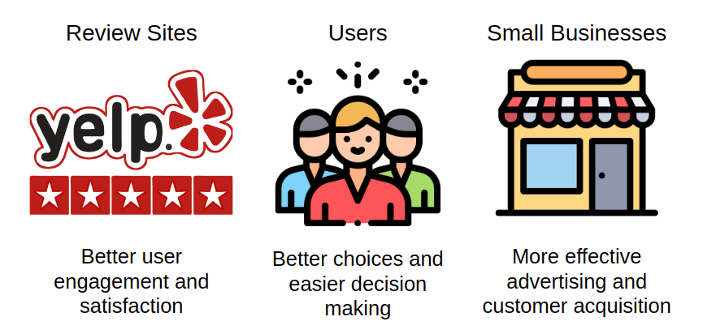
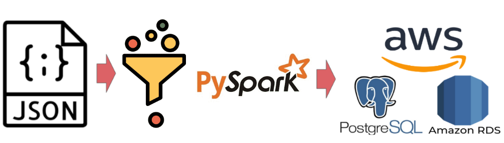
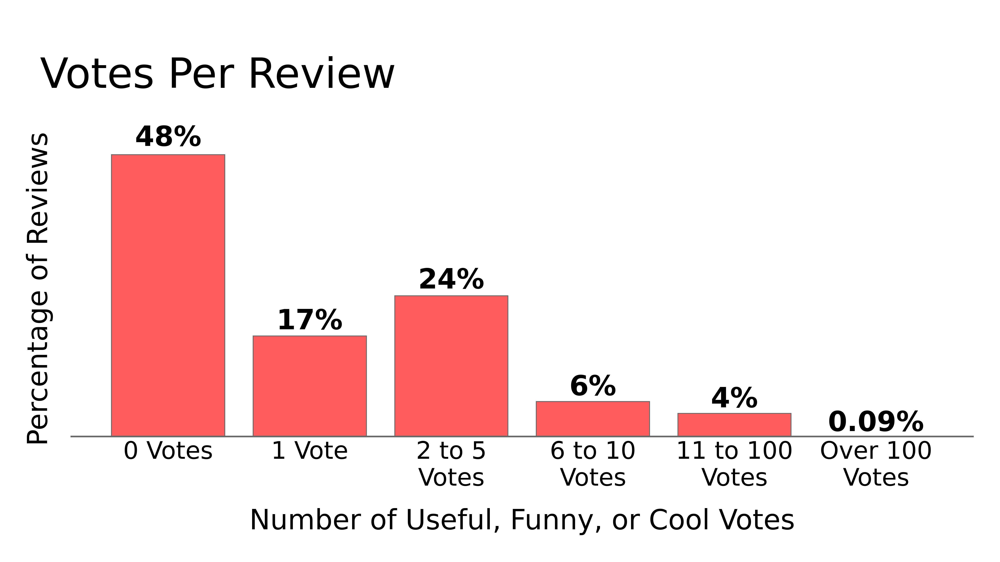
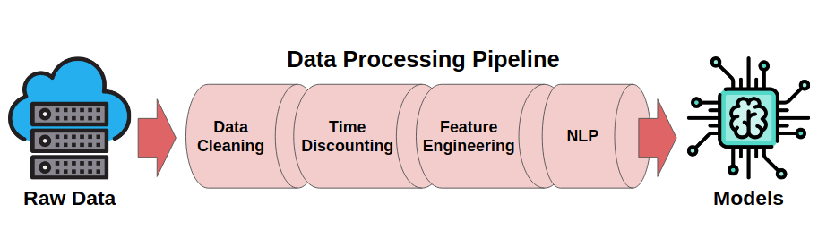
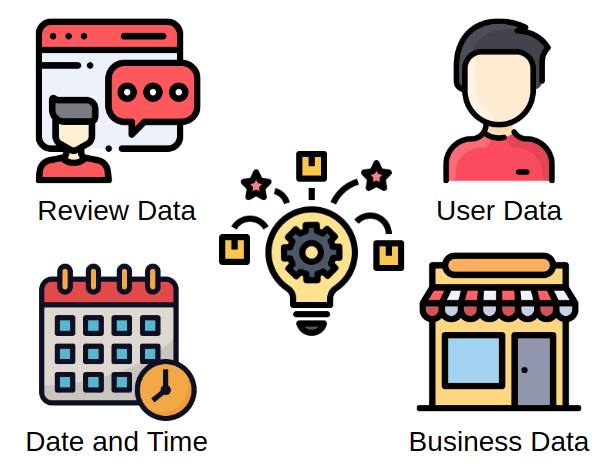
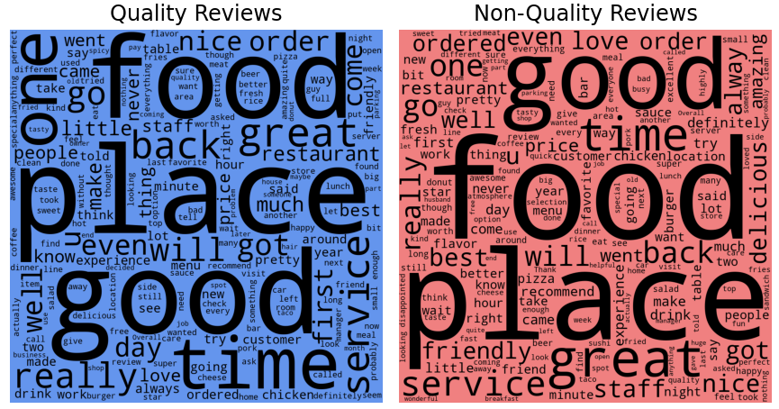
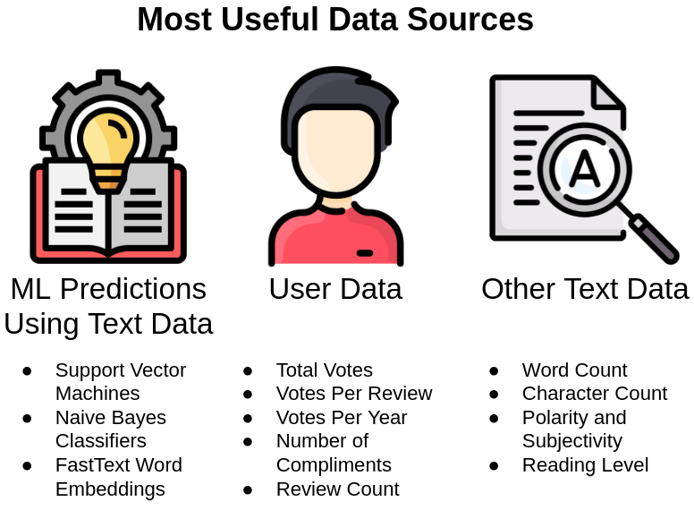

# Predicting Yelp Review Quality

## Table of Contents
* [Introduction](#Introduction)
    * [Motivation](#Motivation)
    * [Goal and Central Questions](#Goal-and-Central-Questions)
    * [The Data](#The-Data)
* [Data Storage and ETL](#Data-Storage-and-ETL)
* [EDA](#EDA)
* [Data Pipeline](#Data-Pipeline)
    * [Data Cleaning](#Data-Cleaning)
    * [Time Discounting](#Time-Discounting)
    * [Target Creation](#Target-Creation)
    * [Metadata Feature Engineering](#Metadata-Feature-Engineering)
* [Exploring the Review Text](#Exploring-the-Review-Text)
* [Data Modeling](#Data-Modeling)
    * [Model Setup](#Model-Setup)
    * [Model Results](#Model-Results)
* [Conclusions](#Conclusions)
* [Photo and Data Credits](#Photo-and-Data-Credits)

  

# Introduction

## Motivation

I have a personal and professional interest in the leisure/tourism industry with a focus on two things:
1. The perceived quality and popularity of places and points of interest (POIs). 
    * Examples: Restaurants, Bars/Nightlife, Breweries, Music Venues, Parks and Outdoor Spaces. 
    * Very broad focus. Pretty much anything that involves the combination of leisure and being in public.
2. Creating a way to connect people to these places/POIs in a way that is more beneficial to both the places/POIs and the people than current common methods. 

Yelp and other similar companies like Foursquare, Google Places, TripAdvisor, etc. are the current leaders in this space, though I believe there are substantial untapped opportunities in this space.
Working with and better understanding the data available to these companies will help us to more fully take advantage of these opportunities.

## Goal and Central Questions

The goal of this project is to explore a way to increase user retention, satisfaction, and engagement for Yelp and any other company that incorporates reviews within its platform. These improvements will be accomplished by predicting the highest quality reviews via information gained from the review text and data surrounding the reviews.

### Central Questions
### 1. Can the quality of a review be determined by the review text or the data surrounding the review?
### 2. What types of data are most useful for predicting review quality?

### Why Quality Reviews Are Important

## The Data

The data for this project comes from the Yelp Open Dataset.  
[Dataset](https://www.yelp.com/dataset), [Documentation](https://www.yelp.com/dataset/documentation/main), [Yelp Github](https://github.com/Yelp/dataset-examples), [Kaggle](https://www.kaggle.com/yelp-dataset/yelp-dataset)

### About Yelp 
> ### *
"Yelp connects people with great local businesses. With unmatched local business information, photos and review content, Yelp provides a one-stop local platform for consumers to discover, connect and transact with local businesses of all sizes by making it easy to request a quote, join a waitlist, and make a reservation, appointment or purchase. Yelp was founded in San Francisco in 2004."
*

[Yelp News](https://www.yelp-press.com/news/default.aspx), [Fast Facts and Stats](https://www.yelp-press.com/company/fast-facts/default.aspx)

### About the Data 

This dataset consists of 5 separate json files totaling ~10GB of data uncompressed. Overall, there is a mix of data-types. The most common ones include long text strings, date-times, booleans, and numerical counts/ratings. There are plenty of nan/null values but this is partially offset by the size of the dataset. The five files consist of:
* **Users**- ~2 million rows and 22 features
    * User metadata, list of friends, and stats about interactions with other users.
* **Reviews**- ~8 million reviews with 9 features.
    * 8 review metadata features and the review text.
* **Check-ins**- ~175000 businesses represented. A couple million total date-times. 
    * Date-times for check-ins for each business. 
* **Businesses**- ~210000 rows with around 30 total features.
    * Business name, address, hours, rating, review count, etc. 
    * Also includes dictionaries of more in-depth attributes like cost, accepts credit cards, good for kids, etc.
* **Tips**- ~1.3 million rows with 5 features
    * Kind of like a really short review without as much useful metadata.

  

# Data Storage and ETL

My original data came in 5 json files. The first step was to simplify, combine, and store these files in a way that would be easily searchable for future data analysis, cleaning, and feature engineering.

The main Extract, Transform, Load (ETL) Pipeline utilized Apache Spark to convert the original json files into a Postgres Database hosted on AWS RDS. 

## Original Working Dataset

Below is a brief look at the original data after I ran it through my data storage process.

|    | review_id              | user_id                | business_id            |   review_stars | review_date         | review_text                  |   review_useful |   review_funny |   review_cool | restaurant_name              | restaurant_address           | restaurant_city   | restaurant_state   | restaurant_postal_code   |   restaurant_latitude |   restaurant_longitude |   restaurant_overall_stars |   restaurant_review_count |   restaurant_is_open | restaurant_categories        |   restaurant_price_range | user_name   |   user_review_count | user_yelping_since   |   user_useful |   user_funny |   user_cool | user_elite               | user_friends                 |   user_fans |   user_average_stars_given |   user_compliment_hot |   user_compliment_more |   user_compliment_profile |   user_compliment_cute |   user_compliment_list |   user_compliment_note |   user_compliment_plain |   user_compliment_cool |   user_compliment_funny |   user_compliment_writer |   user_compliment_photos | restaurant_checkins          |
|---:|:-----------------------|:-----------------------|:-----------------------|---------------:|:--------------------|:-----------------------------|----------------:|---------------:|--------------:|:-----------------------------|:-----------------------------|:------------------|:-------------------|:-------------------------|----------------------:|-----------------------:|---------------------------:|--------------------------:|---------------------:|:-----------------------------|-------------------------:|:------------|--------------------:|:---------------------|--------------:|-------------:|------------:|:-------------------------|:-----------------------------|------------:|---------------------------:|----------------------:|-----------------------:|--------------------------:|-----------------------:|-----------------------:|-----------------------:|------------------------:|-----------------------:|------------------------:|-------------------------:|-------------------------:|:-----------------------------|
|  0 | 48GS5BhOe5Q0exkwH4qIig | r5IC7MVMH9wL-IQKx2CmXg | uh7DUWtPoZkuEE05fghJ_w |              5 | 2016-06-24 14:52:55 | Living in NYC and having ... |               1 |              0 |             0 | Beauty & Essex               | 3708 S Las Vegas Blvd, Le... | Las Vegas         | NV                 | 89109                    |               36.1099 |              -115.175  |                        4   |                      1078 |                    1 | Lounges, Restaurants, Nig... |                        3 | Kelly       |                 122 | 2009-08-19 15:54:29  |           191 |           79 |          41 |                          | 7Mhup6mfEgNAyHyfSBpQ6w, R... |           5 |                       3.81 |                     1 |                      0 |                         0 |                      0 |                      0 |                      0 |                       2 |                      0 |                       0 |                        0 |                        0 | 2016-05-11 02:52:26, 2016... |
|  1 | WxqwVmZhq5-kvvRsUun1-w | 8Dvr-U6jCZTVGD52LwC2qA | orS5gYr8phw6YfV-oEPnTw |              4 | 2018-03-22 03:32:12 | Very, very good rice roll... |               3 |              0 |             2 | Pho Xin Chào                 | 7057 Yonge Street            | Markham           | ON                 | L3T 2A6                  |               43.7996 |               -79.4201 |                        4   |                        49 |                    1 | Desserts, Food, Restauran... |                        2 | Amy         |                 388 | 2015-11-20 04:33:32  |          1149 |           83 |         265 | 2017,2018                | CQ67NJigSe5-uBDX3b_CUw, e... |          41 |                       3.78 |                     7 |                      0 |                         0 |                      0 |                      0 |                      9 |                      13 |                      7 |                       7 |                       12 |                       12 | 2018-03-04 18:29:48, 2018... |
|  2 | 5XwWfBkibiJLn9wBnD2QTQ | 3_a4J7RFtAOSh2maSH1Dlg | ZjKpGYdQCQPxzkYWAsV56w |              5 | 2018-05-18 16:26:27 | The service was quite goo... |               0 |              0 |             0 | Thailicious Authentic Tha... | 19 S Stephanie St, Ste 16... | Henderson         | NV                 | 89012                    |               36.0282 |              -115.049  |                        4.5 |                       604 |                    1 | Restaurants, Thai, Vegeta... |                        2 | Marsha      |                   8 | 2016-02-29 03:03:48  |             0 |            0 |           0 |                          | 8CQRuR-tjDy6uuGU8R7zeg, W... |           0 |                       3.88 |                     0 |                      0 |                         0 |                      0 |                      0 |                      0 |                       0 |                      0 |                       0 |                        0 |                        0 | 2017-09-07 19:49:06, 2017... |
|  3 | B7a8BnvPzCy90yblleT1kQ | 45kX9LyeR_Z4jRcxDAh0cA | ZjKpGYdQCQPxzkYWAsV56w |              5 | 2018-05-05 00:26:20 | The servers were super sw... |               0 |              0 |             0 | Thailicious Authentic Tha... | 19 S Stephanie St, Ste 16... | Henderson         | NV                 | 89012                    |               36.0282 |              -115.049  |                        4.5 |                       604 |                    1 | Restaurants, Thai, Vegeta... |                        2 | Lesly       |                   4 | 2015-11-15 03:55:35  |             0 |            0 |           0 |                          | yDA1FKynHAncG5CiSc8_Zg, x... |           0 |                       3    |                     0 |                      0 |                         0 |                      0 |                      0 |                      0 |                       0 |                      0 |                       0 |                        0 |                        0 | 2017-09-07 19:49:06, 2017... |
|  4 | y0OM430M5gfDJna7I_L5kw | FS6dSo0sGtzeeO9XAoGE4Q | uh7DUWtPoZkuEE05fghJ_w |              4 | 2017-08-07 01:11:41 | Came here with a group of... |               0 |              0 |             0 | Beauty & Essex               | 3708 S Las Vegas Blvd, Le... | Las Vegas         | NV                 | 89109                    |               36.1099 |              -115.175  |                        4   |                      1078 |                    1 | Lounges, Restaurants, Nig... |                        3 | Kristi      |                 224 | 2009-08-31 03:23:42  |           227 |           59 |          90 | 2013,2014,2015,2016,2017 | a4CC6waxI5Qd-QWUnMUOHA, o... |           7 |                       3.95 |                     2 |                      2 |                         2 |                      0 |                      0 |                      3 |                       4 |                      4 |                       4 |                        5 |                        0 | 2016-05-11 02:52:26, 2016... |

  

# EDA

In order to determine the quality of a review I took the sum of the useful, funny, and cool votes that the review has received.
Looking at the distribution of votes per review you can see that about half of all reviews receive no votes at all.
Another sizable portion of reviews receive between 1 and 5 votes.
Very few reviews make it over 10 votes.

  

# Data Pipeline

The original working data was not going to be very usable for analysis and machine learning model training so I created a pipeline that would clean and organize the data as well as add features that could be informative.

## Data Cleaning

The main data cleaning steps included:
* Dropping Nan/Null Values
    * The dataset had plenty of data and a relatively low amount of Nan/Null values so any records with Nan/Nulls were dropped.
* Removing Duplicate Records
* Deleting Unnecessary Features
    * Overall the data had over 100 features and a lot of them were not useful for answering the central questions.
* Converting Data-types
    * This mostly consisted of converting text strings to datetime stamps.
* Organizing Features
    * Features were grouped by source type and sorted to make them easier to wok with during eda and feature engineering.

## Time Discounting

When trying to use the data to answer the questions I wanted to answer, the passage of time creates an issue that must be addressed. 
A lot of the datapoints are counts that were saved at the time the dataset was made public in 2020.
These datapoints increase over time so if we want to use them to predict a review at the time it was created, these datapoints need to be adjusted to represent what they would have been at the time of the review. 
There are two major places where time discounting came into importance:
1. Target Creation - More recent reviews have less time to accumulate votes. This needs to be adjusted for otherwise older reviews will always seem more useful.
2. Feature Engineering - Utilize actual or estimated counts at the time of the review instead of at the time the dataset was released.

## Target Creation

The first goal is to predict the quality of a review but what exactly should we be trying to predict?
Options: 
1. Whether a review is quality or not. (Binary Classification)
2. The level of review quality. Zero, Low, Medium, High (Multi-Class Classification)
3. A numerical value of quality. (Regression)
4. A ranking of the review quality among other reviews. (Ordinal Regression, Classification)

All of these targets have positives and negatives. The focus here is on option 1 since it is the easiest to understand and avoids some of the time discounting pitfalls.

## Metadata Feature Engineering

To try and make it easier to determine if a review is quality, I created new features about the data based off of the interactions between current data features as well as changes in time.
For example, knowing the star rating of a review might be useful but it is probably more useful to know how much more or less that star rating is than the average rating.

Features added include:
* Sums
    * User Up-votes
    * User Compliments
* Counts
    * User Friends Count
    * User Elite Award Count
    * Business Check-in Count
* Time Based
    * User Years Since Last Elite Award
    * User Days Active at Review Time
* Composites
    * Review Stars vs. User Average
    * Review Stars vs. Business Average

  

# Exploring the Review Text

>***Due to the review text being so important, I took a deeper dive into this area using a newer version of the Yelp dataset. This is the most recent "version" of the project and most of the contents of the src, notebooks, and models folders are focused on the review text specifically.***

The most important part of determining the quality of a review is understanding the actual text of the review.

**Why?**
* The text of the review is central to the main goal of the project. Other data points are just a means to reach the main goal. 
* The text of the review does not suffer from the difficulty of estimating time decay that other dataset features are plagued by.
* Insights learned from the text have a better chance of being useful on other types of reviews like Google Places or Amazon Shopping.

## Quick Look

The first step to understanding the review text is to take a look at the most common words in Quality and Non-Quality reviews. As is seen below, the wordclouds of common words are very similar. Unfortunately, this means that seperating which reviews are useful and which are not useful is going to take some more digging and some more powerful tools.

## NLP Feature Engineering

In order to learn more about the review text I created over 100 new features using Natural Language Processing (NLP). These features are condensed and used as the input to a machine learning model that will make the final predictions about whether a review is quality or not.

NLP features added include:
* Basic Text Features
    * Review Length, Word Count, etc.
* Readability 
    * Flesch–Kincaid Grade Level
* Sentiment Analysis
    * Polarity, Subjectivity
* Parts of Speech
    * Noun, Verb, Adjective, etc. 
* Syntactic Dependency Relations 
    * Sentence Structure
* Named Entities
    * Person, Place, Event, etc.
* ML Model Predictions
    * SVM and Naive Bayes using TF-IDF
    * Word Embeddings via fastText
    * Topic Modeling using LDA

  

# Data Modeling

## Model Setup

Throughout the multiple versions of this project, various machine learning models were tested and compared along with multiple dimensionality reduction techniques. PyCaret was used for quick model comparison and testing. Sklearn was used to build the final models. 

### Note About Model Performance Metrics and Decision Threshold

Current Metric - Accuracy
* Most common and well understood metric. Best for an initial proof of concept. 
* If the model is not accurate enough then the second central question about feature importances is not worthwhile. 
* Default 0.5 threshold. Again to get a feel for if the central question is reasonable.

Future Metrics - Precision and Accuracy 
* Typically only a couple reviews are shown to a user.
* If a review that is not quality ends up being predicted as quality (a false positive) and then is surfaced out of hundreds of possible reviews. That is a pretty big failure.
* As the total number of reviews to choose from grows, the more costly a false positive becomes and the less costly a false negative becomes.
* In general the threshold will need to raised to help lower false positives.
* Specifically the threshold should be a function of the number of reviews to be surfaced and the total number of reviews to choose from.
    * The quality of a review is not necessarily relative.
    * The standard for choosing a review is relative.

## Model Results

## Central Question 1:
## Can the quality of a review be determined by data surrounding the review?  

Yes. The quality of a review can be determined with an accuracy better than chance. Both the review text and data surrounding the review are required to get the best possible accuracy.

## Feature Importance

## Central Question 2:
## What types of data are most useful for predicting review quality?

Using feature importances and other methods for determining the most important features, I found that three categories were the most useful in predicting review quality. 

* The most useful were predictions from NLP models using the review text like support vector machines (SVM), Naive Bayes (NB), and fastText.
* The second most useful were data points surrounding the user that created the review.
* The third most useful were other data points extracted from the text like word counts, sentiment analysis, and reading level.

  

# Conclusions
### 1. The quality of reviews can be determined with an accuracy better than chance.
### 2. Data about the review text and the user creating the review are the most important to consider when predicting the quality of a review.

Knowing that the quality of reviews can be predicted, as well as which pieces of data are the most important for these predictions is a stepping stone for helping Yelp and similar companies to better surface reviews that improve user retention, engagement and satisfaction.       

  

# Photo and Data Credits  
**Cover Photo**: Parsehub Blog ["How to Scrape Yelp Data: Business Information, Ratings, Reviews and more..."](https://www.parsehub.com/blog/scrape-yelp-data/) - 9/5/2019  

**Main Data Source**: [Yelp Open Dataset](https://www.yelp.com/dataset) Datasets and Images 

**Other Credits, Sources, Further Research Links**
* Image Credits
    * Machine Learning by Angela from the Noun Project
    * data storage by Alone forever from the Noun Project
    * JSON by Smashicons from flaticon